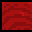
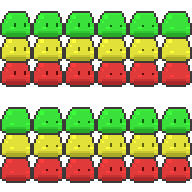

# Jelly-Road-To-Jellyn't
2D platformer ktorý som robil prve predmet Úvod do herného dizajnu na FEI STU v druhom ročníku

## Úvod
Inšpiráciu na hru som z časti zobral z hry Sifu, kde pri smrti postava hráča
starne a chcel som naimplementovať niečo podobné, že by smrť v
platformovke niečo zmenila.

## Ako hrať
Hráč začina so zelenou farbou a smrťou sa mu meni na žltú a potom na
červenú. Farba hráča ovplyvňuje na aké bloky môže stúpiť, pričom zelený môže
iba na zelené, žltý na zelené a žlte a červený na všetky. Takže sa hráčovi
postupne uľahčuje hra, čo sa týka plochy, po ktorej môže chodit, ale zároveň,
sa do hry pridajú nepriatelia, ktorých sa nemôže dotknút. Podstata hry teda je
tá, že hra sa začína tým, že je povedal by som mierne náročna, čo sa týka
skakania a dopadania na správne bloky, ale bez nepriateľov, lenže ak stratí
život alebo dva, tak musí viac dávať pozor na nepriateľov, čo chodia po ploche.
Ovládanie je podľa mňa docela jednoduché, postava sa ovláda tlačítkami A a D
doľava, poprípade doprava a tlačítkom W skáče.

## Základy
Pokračoval som v 2D plošinovke, ktorú som robil skorej v semestri, čiže som
robil podľa nej + podľa tejto série tutoriálov na youtube:
Build a 2D Platformer Game in Unity | Unity Beginner Tutorial

## Prevzaté prvky
* [Sprite postavy (vlastne iba tvar), pozadie, obláčiky](https://assetstore.unity.com/packages/2d/characters/bolt-2d-jellyfarmassets-pack-188722)
* [Portál](https://www.thecryptobulbs.com)
* [Minca](https://www.artstation.com/artwork/R3KvBe)
* [Sprite nepriateľa (lebky)](https://www.shutterstock.com/de/imagevector/human-skull-pixel-art-icon-isolated-1965417196)
* [Efekty (skok, nazbieranie mince, smrť)](https://assetstore.unity.com/packages/audio/sound-fx/free-casualgame-sfx-pack-54116)
* [Hudba v pozadí(aj s timestampom)](https://www.youtube.com/watch?v=xb0cMDEyMzg&t=3904s)

## Vlastné prvky
* Farby a animácie (beh, skok, pád, smrť, idle) na sprite-ov postavy (zelený, žltý, červený)

* Dizajn blokov, po ktorých postava skáče

* Animácia nepriateľa (lebky)

* Animácia 3 slime-ov na začiatku a konci hry

* Dizajn počtu srdiečok/životov

)
